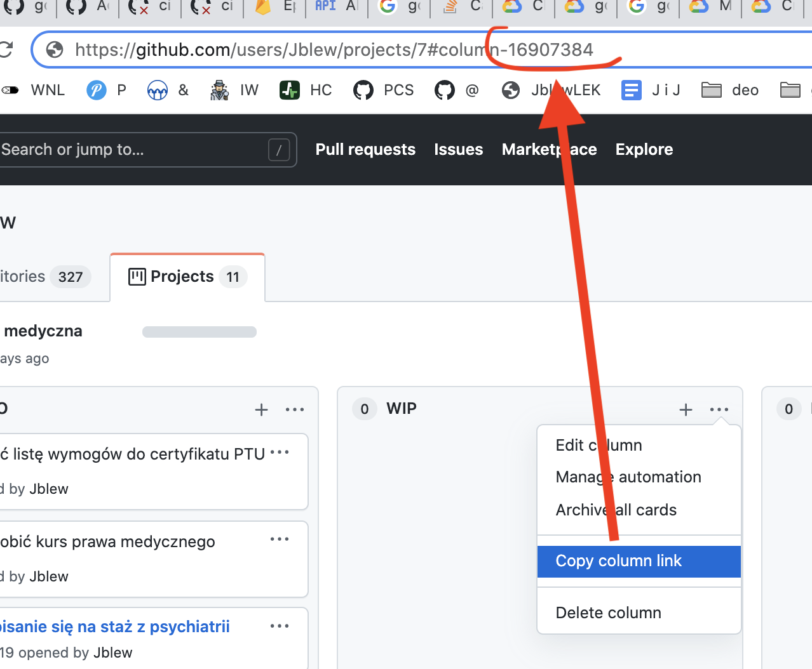

# siri-open-github-issue

Open github issue with siri! Docker/Firebase/CloudRun endpoint

Features:

- Use Siri shortcut to easily create github issue
- Github issue can be added to Github project (a kanban) (for triage)
- Prevents unwanted access with apikey specified via env
- Configuration via environment variables allows direct deployment to cloud
- Below examples for docker-compose and for Google Cloud (GCP) CloudRun

## Installation

Images:

- docker.io/jedrzejlewandowski/siri-open-github-issue
- ghcr.io/jblew/siri-open-github-issue

## Usage

### With docker-compose

```yaml
version: "3.7"
services:
  server:
    build: .
    command: npm run start
    environment:
      APIKEY_FOR_CLIENTS: "inmysecretlife123" # Api for clients to provide (to prevent unwanted access)
      OWNER: Jblew # Repository owner
      REPO: ephemeris # Repository name
      GITHUB_TOKEN: "" # You Github Personal Access Token
      PROJECT_COLUMN_ID: 764 ## Id of a column in Github project (below instructions on how to find it)
    ports:
      - 8080:80
```

### With Google Cloud (GCP) Clud Run

```sh
gcloud beta run deploy "${SERVICE_NAME}" \
            --region "${GCP_REGION_CLOUDRUN}" \
            --image "docker.io/jedrzejlewandowski/siri-open-github-issue" \
            --allow-unauthenticated \
            --set-env-vars="APIKEY_FOR_CLIENTS=${APIKEY_FOR_CLIENTS},OWNER=${OWNER},REPO=${REPO},GITHUB_TOKEN=${GITHUB_TOKEN},PROJECT_COLUMN_ID=${PROJECT_COLUMN_ID}"
```

## Setting up Siri shortcut


## Misc

### How to find ID of a Github project column


